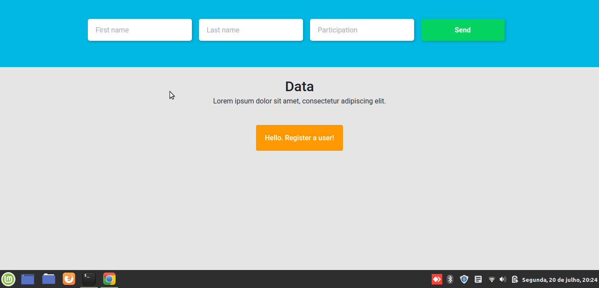

<h1 align="center">
  Manage Participations
</h1>

<p align="center">
  

  

 
  <a href="https://github.com/JonasCastro/fullstack-challenge-cotabox/commits/master">
    
  </a>
    
   

  <a href="https://www.linkedin.com/in/jonas-castro-b4044111a/">
    
  </a>
  
 
 
</p>

<h4 align="center"> 
	🚧  Manage Participations 📊 Concluído ✅ 🚧
</h4>

<p align="center">
 <a href="#-sobre-o-projeto">Sobre</a>&nbsp;&nbsp;&nbsp;|&nbsp;&nbsp;&nbsp;
 <a href="#wrench-funcionalidades">Funcionalidades</a>&nbsp;&nbsp;&nbsp;|&nbsp;&nbsp;&nbsp;
 <a href="#-layout">Layout</a>&nbsp;&nbsp;&nbsp;|&nbsp;&nbsp;&nbsp;
 <a href="#-como-executar-o-projeto">Como executar</a>&nbsp;&nbsp;&nbsp;|&nbsp;&nbsp;&nbsp;
 <a href="#-tecnologias">Tecnologias</a>&nbsp;&nbsp;&nbsp;|&nbsp;&nbsp;&nbsp;
 <a href="#autor">Autor</a>&nbsp;&nbsp;&nbsp;|&nbsp;&nbsp;&nbsp;
 <a href="#memo-licença">Licença</a>
</p>

## 💻 Sobre o projeto

:bar_chart: Manage Participations - tem como objetivo registrar participantes e seu percentual de participação representando essa distribuição em um gráfico de pizza.

---


## :wrench: Funcionalidades

- [x] É possível registrar participantes na plataforma web enviando:
  - [x] primeiro nome do participante
  - [x] sobrenome do participante
  - [x] percentual de participação

---

## 🎨 Layout

<p align="center" style="display: flex; align-items: flex-start; justify-content: center;">
  
</p>

---

## 🚀 Como executar o projeto

Este projeto é divido em duas partes:
1. Backend (pasta server) 
2. Frontend (pasta web)

💡O Frontend precisa que o Backend esteja sendo executado para funcionar.

### Pré-requisitos

Antes de começar, você vai precisar ter instalado em sua máquina as seguintes ferramentas:
[Git](https://git-scm.com), [Node.js](https://nodejs.org/en/), [MongoDB](https://www.mongodb.com/).

### Primeiro Passo

```bash

# Clone este repositório
$ git clone https://github.com/JonasCastro/fullstack-challenge-cotabox.git

# Acesse a pasta do projeto no terminal/cmd
$ cd fullstack-challenge-cotabox

```

#### 🎲 Rodando o Backend (servidor)

```bash

# Vá para a pasta backend
$ cd backend

# Instale as dependências
$ yarn

# Execute a aplicação em modo de desenvolvimento
$ yarn dev:server

# O servidor inciará na porta:3333

# Para executar os teste
$ yarn test

```
<p align="center">
  <a href="https://github.com/JonasCastro/fullstack-challenge-cotabox/assets/insomnia_API.json" target="_blank"></a>
</p>


#### 🧭 Rodando a aplicação web (Frontend)

```bash

# Vá para a pasta da aplicação Front End
$ cd front

# Instale as dependências
$ yarn

# Execute a aplicação em modo de desenvolvimento
$ yarn start

# A aplicação será aberta na porta:3000 - acesse http://localhost:3000

```
#### 💉 Testes da aplicação

```bash
# Para executar os teste
$ yarn test

```
Testes Backend

- **`should be able to list the users`**: A aplicação deve permitir que seja retornado um array com todos os participantes que foram criados até o momento.

- **`should be able to create a new user`**: A aplicação deve permitir que um participante seja criado.

- **`should be able to delete the user`**:  A aplicação deve permitir que um participante seja deletado.

- **`should not be able to delete a user that does not exist`**: A aplicação não deve poder excluir um participante que não existe. Caso não exista, retornar um erro com status `400`.

---

## 🛠 Tecnologias

As seguintes ferramentas foram usadas na construção do projeto:

#### **Website**  ([React](https://reactjs.org/)  +  [TypeScript](https://www.typescriptlang.org/))

-   **[React Router Dom](https://github.com/ReactTraining/react-router/tree/master/packages/react-router-dom)**
-   **[React Icons](https://react-icons.github.io/react-icons/)**
-   **[Axios](https://github.com/axios/axios)**
-   **[Styled Components](https://styled-components.com/)**
-   **[Unform](https://unform.dev/)**
-   **[Yup](https://github.com/jquense/yup)**
-   **[Polished](https://polished.js.org/)**

> Veja o arquivo  [package.json](https://github.com/JonasCastro/fullstack-challenge-cotabox/blob/master/front/package.json)

#### [](https://github.com/JonasCastro/fullstack-challenge-cotabox#server-nodejs--typescript)**Server**  ([NodeJS](https://nodejs.org/en/)  +  [TypeScript](https://www.typescriptlang.org/))

-   **[Express](https://expressjs.com/)**
-   **[CORS](https://expressjs.com/en/resources/middleware/cors.html)**
-   **[MongooseJS](https://mongoosejs.com/)**
-   **[MongoDB](https://www.mongodb.com/)**
-   **[ts-node](https://github.com/TypeStrong/ts-node)**
-   **[Celebrate](https://github.com/arb/celebrate)**
-   **[ExpressAsyncErrors](https://www.npmjs.com/package/express-async-errors)**
-   **[Tsyringe](https://github.com/microsoft/tsyringe)**
-   **[JestJS](https://jestjs.io/)**


> Veja o arquivo  [package.json](https://github.com/jonasCastro/fullstack-challenge-cotabox/blob/master/backend/package.json)

#### [](https://github.com/tgmarinho/Ecoleta#utilit%C3%A1rios)**Utilitários**


💡 Sugestão editor para trabalhar com o código: 
  - [VSCode](https://code.visualstudio.com/)
    - [EditorConfig](https://editorconfig.org/)
    - [ESLint](https://eslint.org/)

-   Gráficos:  **[ChartJS](https://www.chartjs.org/)**
-   Editor:  **[Visual Studio Code](https://code.visualstudio.com/)**  → Extensions:  **[ESlintJS](https://marketplace.visualstudio.com/items?itemName=dbaeumer.vscode-eslint)**, **[EditorConfig](https://marketplace.visualstudio.com/items?itemName=EditorConfig.EditorConfig)**
-   Markdown:  **[StackEdit](https://stackedit.io/)**,  **[Markdown Emoji](https://gist.github.com/rxaviers/7360908)**
-   Teste de API:  **[Insomnia](https://insomnia.rest/)**
-   Ícones:  **[Feather Icons](https://feathericons.com/)**
-   Fontes:  **[Roboto](https://fonts.google.com/specimen/Roboto)**


---


## Autor

Jonas Castro

[](https://www.linkedin.com/in/jonas-castro-b4044111a/) 

[](mailto:jonascastro128@gmail.com)

---

## :memo: Licença

Este projeto esta sobe a licença [MIT](./LICENSE).

---
Feito com :blue_heart: por Jonas Castro :wave: [Entre em contato!](https://www.linkedin.com/in/jonas-castro-b4044111a/)
